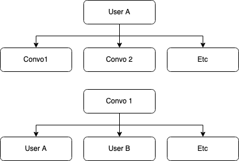
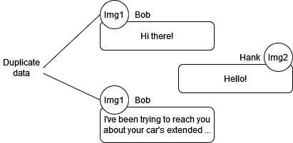

# About the project
The purpose of this app is to develop my skills and showcase the basics of React Native interacting with a database to create a real-time chat application.
The project was created during an internship at Pentia Mobile and commit 519c80f on Aug 21st 2023 was evaluated to be around junior level. Development is ongoing and further commits reflect my attempts to improve the project based on feedback received.

# Code principles
In order to master the fundamentals of good code practice, I strive to write DRY code, separate concerns and provide adequate data modeling with some thought given to normalization.
### DRY code
Don't Repeat Yourself-code - if several functions use identical lines of code, it's likely much more efficient to refactor those lines into an independent function to call as needed.
### Separation of concerns
Separating concerns between code blocks makes it much easier to change functionality, trace issues and add features. Separated concerns also aid in keeping code DRY, as e.g. a stand-alone login() function can be called anywhere without the need to re-type a single one of its contained lines.
### Data modeling
Data modeling is the practice of creating good models for stored data in the database. Typical concerns are speed and storage, where unnecessarily large file transfers risk creating noticable delays in the chat experience. Since this project uses Firebase, a non-relational database, there is considerable freedom in the specifics of the models. However, I strive to keep consistent data models in order to reduce errors and avoid unnecessary data duplication.
### Normalization
Normalization is the practice of reducing duplicated data, especially in relational databases. This can greatly reduce the storage required, but may come at the cost of speed. For a chat application, one would expect many small read/write operations on the database. In this case, we often want to store related data in the same document for faster load speeds.

## Data modeling example 1: How to structure the conversation
Every user should be able to participate in any number of conversations. \
Similarly, every conversation should be able to contain any number of users (though possibly at least 2).

   

A simple and data efficient way to ensure this is to attach each participant's unique identifier to the individual conversation in the database. Similarly, it is trivial to add a list of conversation IDs to each user in the database to track which conversations they are part of. \
With this in place, loading the correct conversations becomes a matter of querying the database on login, looking for the relevant conversations to load.

This simple model ensures that we do not store the complete user profiles in each conversation or, worse, store the entire conversation in each participant's user storage, where the data would need to be duplicated for every single participant.

## Example 2: How to structure the message
Sometimes, the proper data model is a little less clear, especially when considering the individual message.
In the image below, we see a conversation between Bob and Hank. Each message contains the message text, the sender's name and the sender's avatar. A real world example would also potentially contain a sent image and would definitely carry the message's metadata (such as timestamp, whether the message is sent / received / read, and so on).

   

How do we optimize for fast read/write operations? A user's avatar might be a particularly large file size, and that user might enjoy sending many messages in rapid bursts. The same user might enjoy sending HD images in their messages, compunding on data costs.

Storing a duplicate avatar for each sent message seems like a certain way to balloon database demands with little to no benefit. Rather, storing a single image in the database (and potentially clientside) to be referenced from the message object will likely be faster and provide good savings on space.

Compressing any images sent and received through the chats, as well as limiting size on sent files, would further reduce database demands (and cost), but I leave that for another project.
